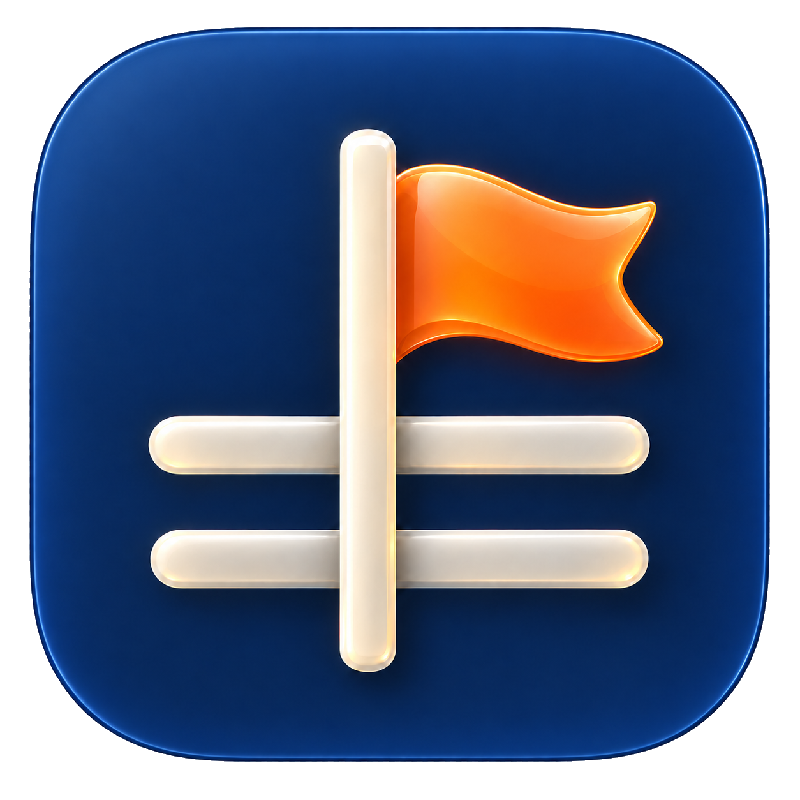

# YeahBouy



YeahBouy is a lightweight desktop tray activity logger for macOS, Windows, and
Linux. Launch it to open the activity panel, or click its tray icon later. Keep
a simple, portable daily log.

## What it does

- Captures an activity with a timestamp by pressing Enter or clicking **Log activity**.
- Provides category chips, a search for the selected day, and a monthly activity summary.
- Offers Development, Research, and Paperwork categories, saved as a final line of Markdown hashtags (for example, `#Development #Research`) and displayed as colored badges.
- Shows today's full date and today's entries in the compact menu-bar panel.
- Lets you use the panel's **Back** and **Forward** buttons to browse earlier daily logs without opening the calendar. Forward stops at today.
- Provides a calendar-based History window for browsing a month at a time and opening a selected day's Markdown file.
- Shows activity markers on days with logs and a clear empty state when a day has no entries.
- Lets you choose a Markdown folder from the folder button in the panel footer; the choice is remembered.
- Stores every day as readable Markdown; no database service is required.

## Storage

Logs live in the platform's user data directory:

```text
macOS:   ~/Library/Application Support/YeahBouy/logs/YYYY-MM-DD.md
Windows: %APPDATA%/YeahBouy/logs/YYYY-MM-DD.md
Linux:   $XDG_DATA_HOME/YeahBouy/logs/YYYY-MM-DD.md
```

When `XDG_DATA_HOME` is unset on Linux, logs use `~/.local/share/YeahBouy/logs`.
Use the folder button at the bottom of the panel to pick another destination;
YeahBouy remembers it for future launches.

Set `YEAHBOUY_LOGS_DIR` to use a different log directory (useful for backups or
testing). Existing Markdown files are read as-is; YeahBouy creates a daily file
only when its first activity is recorded. Markdown heading-like lines inside an
activity are escaped so they remain part of that entry.

Choosing another folder changes where future logs are saved; existing files are
left in their original folder and are not moved.

YeahBouy creates a day's file only after its first activity is recorded. Reading
or browsing a day never creates a new file.

Each log is ordinary Markdown, for example:

```markdown
# YeahBouy — 2026-07-21

## 2026-07-21 09:30:00
Review release checklist
```

## Run from source

Requirements: Python 3.10 or newer and a desktop environment with a system tray.

```bash
python3 -m venv .venv
source .venv/bin/activate
pip install -r requirements.txt
python main.py
```

## Tests

```bash
python -m pytest
```

## App icon

- `assets/yeahbouy-mark.png` is the source artwork (transparent PNG) and the
  in-app header logo.
- `assets/yeahbouy.icns` is generated from it with `sips` + `iconutil` and
  used as the macOS app icon.
- `assets/yeahbouy-menubar.svg` is the monochrome menu-bar tray icon.
- `assets/icons/` holds the UI glyphs in Icons8 liquid-glass style
  (search, chart, categories, history, folder, quit, navigation).
  Free use requires a link credit: icons by [Icons8](https://icons8.com/icons/liquid-glass).
- Export the PNG with transparency; a preview checkerboard baked into the
  pixels renders as a visible box in the Dock and the app.

## Build the macOS app

With the virtual environment activated:

```bash
pip install pyinstaller
pyinstaller --noconfirm --windowed --name YeahBouy --icon assets/yeahbouy.icns --codesign-identity - --osx-entitlements-file assets/entitlements.plist --add-data 'assets/yeahbouy-menubar.svg:assets' --add-data 'assets/icons:assets/icons' --add-data 'assets/yeahbouy-mark.png:assets' main.py
```

The rebuilt application is placed at `dist/YeahBouy.app`. The `--noconfirm`
option replaces the prior generated app bundle.

## GitHub Actions builds and releases

The **Package app** workflow runs tests and builds downloadable ZIP artifacts
for Apple Silicon macOS, Intel macOS, Windows, and Linux. Run it manually from
the Actions tab, or push a date tag (`YYYY-MM-DD`) to build all four and publish
a GitHub Release using `CHANGELOG.md` as its notes, with the platform ZIPs
attached. Add `-N` to the tag for another release on the same date. Choose the
macOS build matching your Mac's chip in **About This Mac**.

The macOS build is ad-hoc signed, not notarized. On first launch, Control-click
`YeahBouy.app` and choose **Open** if macOS asks for confirmation.

```bash
git tag "$(date +%F)"
git push origin "$(date +%F)"
```
